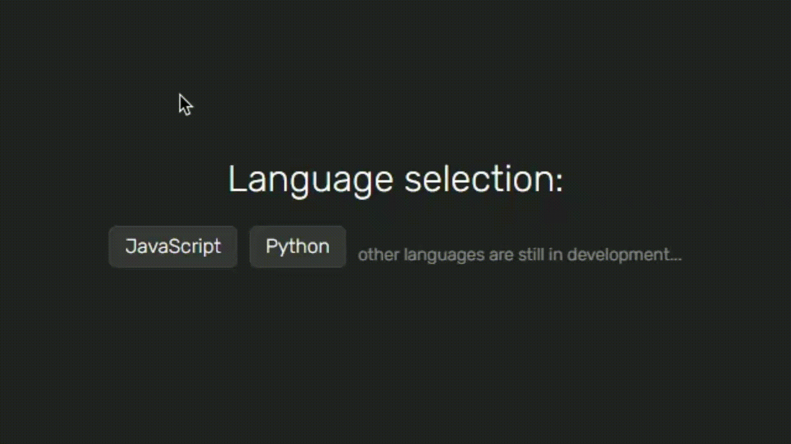

# 🧑‍💻 CodeGuess - Проверь, как хорошо понимаешь код

[](https://vuejs.org/)
[](https://pinia.vuejs.org/)
[](https://router.vuejs.org/)
[](https://www.typescriptlang.org/)
[](https://tailwindcss.com/)
[](https://mokky.dev/)
[](https://highlightjs.org/)
[](https://vitejs.dev/)

### https://hutt4.github.io/codeguess

**CodeGuess** - тренажёр для развития навыков чтения и понимания кода.
Вводи результат выполнения кода - и смотри, насколько ты внимателен к деталям.

Задачи постепенно усложняются: от простых конструкций до нюансов работы **Event Loop**, асинхронности и ловушек синтаксиса.

🧠 Отличный способ прокачать понимание кода и внимательность.



## 🧬 Доступные языки

- JavaScript
- Python

## 🌟 Особенности

### Функционал

- 🎯 Напиши, что выведет код
- 📈 Уровни сложности от простого к продвинутому
- ⌛ Тренировка внимательности и глубины понимания кода

### Backend и API

- 📦 Задачи загружаются с [mokky.dev](https://mokky.dev) - mock-сервера с REST API
- 💾 Прогресс сохраняется в `localStorage`, чтобы ты мог продолжить позже

### Интерфейс

- 📲 Адаптивный интерфейс
- 🎨 Подсветка кода через [highlight.js](https://highlightjs.org/)

## 🛠 Технологии

### Frontend

- [Vue 3](https://vuejs.org/) - Фреймворк
- [Pinia](https://pinia.vuejs.org/) - Управление состоянием
- [Vue Router](https://router.vuejs.org/) - Навигация
- [TypeScript](https://www.typescriptlang.org/) - Типизация
- [Tailwind CSS](https://tailwindcss.com/) - Утилитарная стилизация

### Backend / Utilities

- [Mokky.dev](https://mokky.dev/) - Мок-сервер и REST API
- [Highlight.js](https://highlightjs.org/) - Подсветка синтаксиса
- [Vite](https://vitejs.dev/) - Сборка проекта

## 🚀 Быстрый старт

```bash
git clone https://github.com/huTT4/codeguess.git

cd codeguess

npm install

npm run dev
```
